+++
title = "CheckName"
weight = 5
[extra]
tag = 5
+++

The CheckName RPC is used by joining players to ask the host to update their name, usually their username for their login in the menu.

<!-- more -->

```
Rpc[5] := name:str;
```

|            |                                          |
| ---------- | ---------------------------------------- |
| Sent by:   | A player when joining the lobby          |
| Called on: | PlayerControl of the joining player      |

Sent by a joining player's PlayerControl to the host to get their display name updated.

When received by the host, the host should check whether the name requested is already in use, and if so, append a number to the end to distinguish that player from others with the same name. Then the, host sets the player's name with [SetName](@/networking/rpc/06_setname.md).


