+++
title = "CheckColor"
weight = 7
[extra]
tag = 7
+++
The CheckColor RPC is used by joining players to ask the host to set their color.

<!-- more -->

```
Rpc[7] := color:str;
```

|            |                                          |
| ---------- | ---------------------------------------- |
| Sent by:   | A player when joining the lobby          |
| Called on: | PlayerControl of the joining player      |

Sent by a joining player's PlayerControl to the host to get their display color updated.

When received by the host, the host should check whether the color requested is already in use, and if so, use the next color available instead. Then the, host sets the player's color with [SetColor](@/networking/rpc/08_setcolor.md).


