+++
title = "MurderPlayer"
weight = 12
[extra]
tag = 12
+++

This RPC is sent by the host when a murder is attempted on another player.

<!-- more -->

```
Rpc[12] := target:netObject;
```

|            |                                          |
| ---------- | ---------------------------------------- |
| Sent by:   | Host of the game (Since 2021.11.9)       |
| Called on: | {{ link(to="PlayerControl") }} of the killing Impostor    |
| Target is: | The {{ link(to="PlayerControl") }} that is being murdered |

This packet is sent by the host of the game when a [CheckMurder](@/networking/rpc/47_checkmurder.md) RPC is received by the host. When each player receives this packet, they will check if the target is actively protected (see [ProtectPlayer](@/networking/rpc/45_protectplayer.md)). If this is the case, the protection is removed and an animation is shown that shows the shield breaking. If the target is not protected, they are marked as killed by the owner of the {{ link(to="PlayerControl") }} this RPC was called on and become a ghost.

The impostor that performed the kill will get a cooldown, but if the kill was blocked by a protection shield, the cooldown is halved.



## Version History

| Version   | Change                                             |
| --------- | -------------------------------------------------- |
| < 2021.x  | Introduced, sent by impostor when killing a player |
| 2021.11.9 | Now sent by host                                   |
