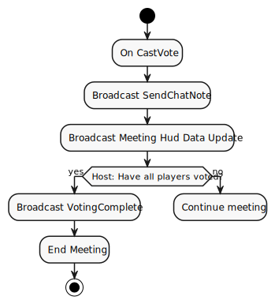

+++
title = "CastVote"
weight = 24
[extra]
tag = 24
+++
The CastVote Rpc is used to tell the host that a player has made a vote in the voting screen.

<!-- more -->

```
Rpc[24] := voter:u8 suspect:u8;
```

|             |                                                       |
| ----------- | ----------------------------------------------------- |
| Sent by:    | A player when they vote another player to be ejected  |
| Called on:  | MeetingHud spawned when the meeting started           |
| Sent to:    | The host of the room                                  |
| Voter is:   | The player ID of the player casting the vote          |
| Suspect is: | The player ID of the suspect who the player is voting |

Sent by a player the host of the room when the player votes another player to be ejected.

The host should then send a [SendChatNote](@/networking/rpc/16_sendchatnote.md) to all players, indicating that they have made a vote in the chat box.

This should also trigger a [Data](@/networking/gamedata/1_data.md) update for the MeetingHud in question, sent to all clients to update all vote states.


